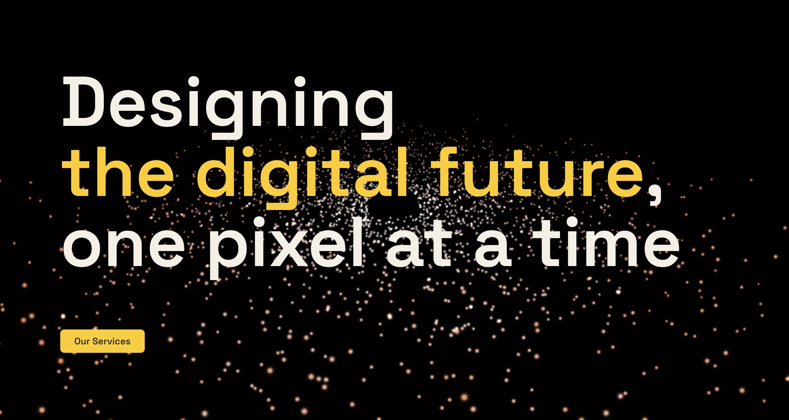
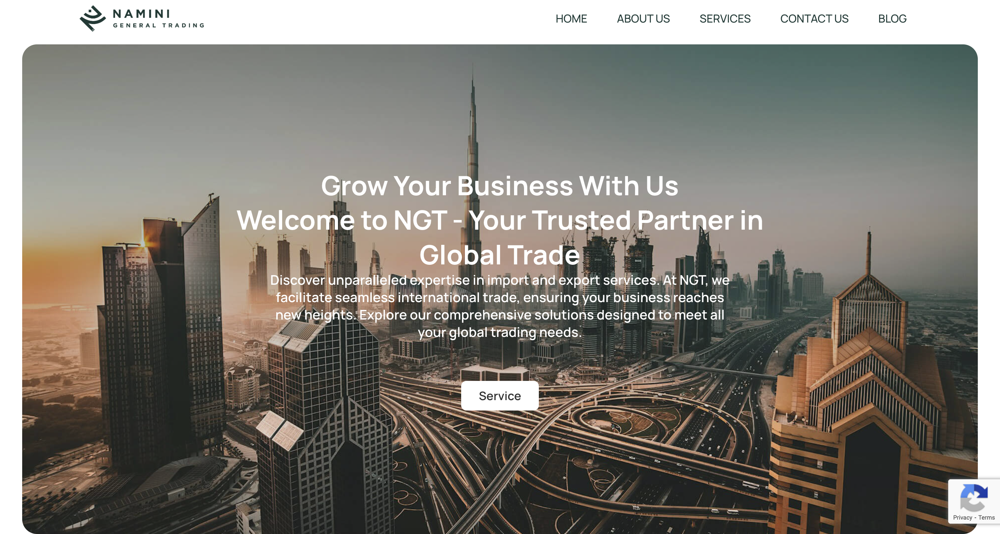

### Hi there!

#### A Varia Vantaa Student

I’m a passionate web development student diving into the world of modern front-end technologies. I work with Figma, WordPress, React.js, Tailwind CSS, and I'm currently exploring creative coding with Three.js. Always learning, always building — I love bringing ideas to life on the web.

---

    
  
  
  
  
  
  
  
  
  
  
  
  
  
  
  
  
  
  
  
  
  
  

---

## Projects

### Web Development

- [**Boardgamecafe**](https://github.com/Nasrin-MT/boardgamecafe)
  [🔗 Live Demo](https://cafeboardgame.onrender.com) (https://cafeboardgame.onrender.com)  
   A full-stack web platform for a real-life café offering table and board game reservations, event listings, and a Stripe-powered checkout. Includes multilingual support, working hours logic, and a full admin panel for managing tables, prices, and events.  
   _Tech stack: React, Node.js, Express, MongoDB, Mongoose, Stripe, JWT, HTML, CSS, Tailwind CSS, MUI, SweetAlert2, Day.js, libphonenumber-js, express-validator, Moment-Timezone, Nodemailer, bcryptjs_

---

## 🌐 Portfolio & Work

- 🧑‍🎨 **Portfolio & Agency Site**: [nasrindesign.com](https://nasrindesign.com/home)  
   WordPress-based site showcasing creative work and the Galaxy Three.js React component.
  

- 🛒 **E-commerce Website**: [lavazemsavarkarinamini.com](https://lavazemsavarkarinamini.com/)  
  A full WooCommerce-powered online store.
  

- 🏢 **Business Site**: [naminigeneraltrading.com](https://naminigeneraltrading.com/)  
  A clean, professional WordPress site built for a trading company.
  

---

### 🤝 Let’s Connect

- 💼 [LinkedIn](https://www.linkedin.com/in/nasrin-tabar-787205205/)
- 🌐 [nasrindesign.com](https://nasrindesign.com/home)

Feel free to reach out if you’d like to collaborate or discuss interesting projects!

<!--
**Nasrin-MT/Nasrin-MT** is a ✨ _special_ ✨ repository because its `README.md` (this file) appears on your GitHub profile.

Here are some ideas to get you started:

- 🔭 I’m currently working on ...
- 🌱 I’m currently learning ...
- 👯 I’m looking to collaborate on ...
- 🤔 I’m looking for help with ...
- 💬 Ask me about ...
- 📫 How to reach me: ...
- 😄 Pronouns: ...
- ⚡ Fun fact: ...
-->
